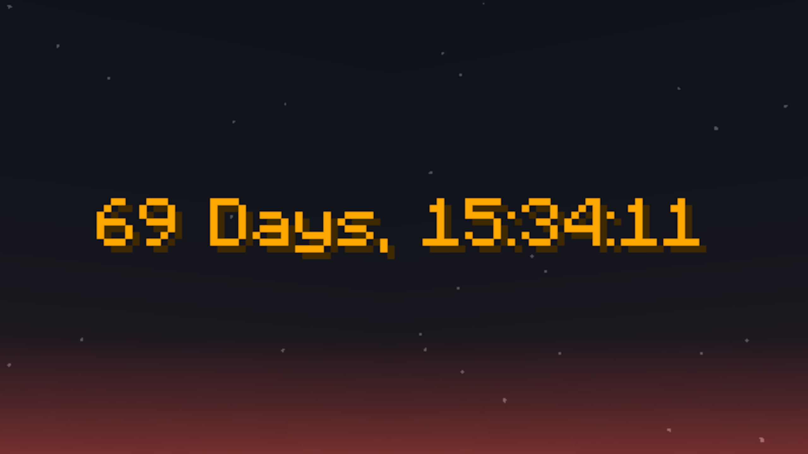

# (Challenge) Timer by Aircraft192

## Summary
This Datapack adds a handy little clock over your hotbar. It counts your playtime based on ticks. It could be used in Minecraft Challenges on YouTube or just to measure your addiction to Minecraft😅
## Basic features
### Pausing and unpausing
```mcfunction
/function aircraft192:timer/pause
```
```mcfunction
/function aircraft192:timer/play
```
### Resetting the timer
```mcfunction
/function aircraft192:timer/reset
```
### Toggling the display
```mcfunction
/function aircraft192:timer/display/on
```
```mcfunction
/function aircraft192:timer/display/off
```
This could also be useful for datapack developers.
### Puasing while offline
The timer is configured to pause when no players are online (only useful for servers). If you want to disable / reenable this behaviour, you can use:
```mcfunction
/function aircraft192:timer/pausewhileoffline/on
```
```mcfunction
/function aircraft192:timer/pausewhileoffline/off
```
## Countdown timer
As of version 4.0, you can use this datapack as a countdown timer too. To enable or disable this feature, use:
```mcfunction
/function aircraft192:timer/settings/countdown/on
```
```mcfunction
/function aircraft192:timer/settings/countdown/off
```
## How to install
You can either grab the current release on PMC or download the developement version via the "Download ZIP" option on GitHub.

[](https://www.planetminecraft.com/data-pack/timer-by-aircraft192/)
## READ IF YOU WANT TO USE THIS IN VERSION 1.20 OR OLDER
Since Mojang changed the name “functions” in Minecraft datapacks to “function” in 1.21, this datapack is not compatible with older versions.
You can avoid this incompatibility by following these steps:
1. Extract the datapack to the datapacks folder of your world (DON'T USE THE .ZIP-FOLDER FOR THIS!)
2. Go to the path `/datapack-name/data/minecraft/tags/` and rename the folder named "function" to "functions"
3. Go to every other folder in the `/datapack-name/data/` directory and rename every folder there named "function" to "functions"
4. The datapack should now work for versions 1.20 and lower

If this datapack receives enough attention, I may provide a second Download for these older versions.